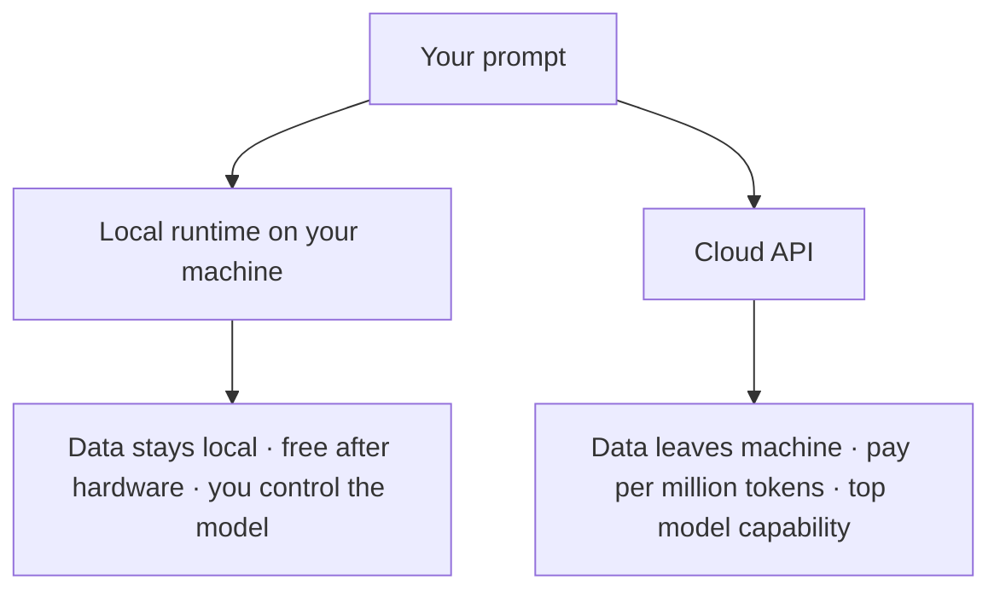

# Running and Building with Local LLMs — A Practical Guide for Developers

*Part 0 of 4 · Introduction & map*

Most developers meet large language models through a cloud API: you send tokens up, you get tokens back, you pay per million. That works, but it hides three things that matter once you move past the demo: **where your data goes, what it costs at scale, and how much control you actually have.** Running models *locally* — on your own laptop or your own GPU box — flips all three. Your data never leaves the machine, inference is free after the hardware, and you decide exactly which model runs and when it changes.

<!-- medium: assets/local-vs-cloud.png -->

The catch used to be that local models were toys. That is no longer true. By 2026 the gap between the best open-weight models and the best closed ones, measured on human-preference coding leaderboards, has compressed from roughly 150 Elo to about 30 ([LM Arena Code](https://lmarena.ai/leaderboard/code)) [R-036]. Open models like the Qwen 3.x, GLM-5.x, Kimi K2.x and Devstral families are now genuinely useful for real engineering — and they run on a modern laptop. At the frontier, fully open-weight releases like DeepSeek-V4 (a 1.6-trillion-parameter mixture-of-experts, MIT-licensed) now ship the same week as their closed rivals; the interactive map's **Hardware** tab sizes each one against the GPUs it takes to serve it.

This guide is the practical path from "I've heard of local LLMs" to "I serve one, code with it, and ship apps on it." It is deliberately **tool-first**. We name the theory and link the papers so you can go deeper, but we do not open the attention-layer black box. The goal is fluency with the tools that already implement these ideas.

## The one idea that makes everything click

Almost every modern LLM tool speaks the **OpenAI-compatible API**. Serve a local model once, and every downstream tool — your editor's AI extension, your terminal coding agent, your Python or .NET app — connects to the same endpoint by changing a **base URL**. Learn to serve a model, and you've unlocked the entire ecosystem. Swapping between your local model and a frontier cloud model becomes a two-line change.

## How this guide is organized

We climb four layers, each its own part:

- **[Part 1 — Concepts, fast.](part-1-concepts.md)** The vocabulary of the field, organized as three pillars: **prompt engineering**, **context engineering**, and the **harness / agentic** layer. Every key term gets a one-line definition and a link to the paper it came from. This is the part you skim if you're experienced and study if you're not.
- **[Part 2 — The tools.](part-2-tools.md)** LM Studio, Roo/Kilo Code, Claude Code, opencode, Hermes Agent — what each is, how to install it, how they combine, and a decision matrix for the perennial *Ollama vs LM Studio vs Unsloth* question.
- **[Part 3 — Serve a model and code with it.](part-3-serve-and-code.md)** Standing up an OpenAI-compatible server with LM Studio, wiring it into VS Code and into CLI agents, the Claude Code subscription path *and* the fully open-source path, and a framework for choosing which model your hardware can actually run.
- **[Part 4 — Hands-on projects.](part-4-projects.md)** A real flagship app — a sentiment analyzer built on Gradio + the OpenAI SDK against your local LM Studio model, with JSON-schema structured output validated by Pydantic — written so you swap the local model for a cloud provider by changing three env vars. A folder of supplementary demos (prompting, RAG, full-stack, agentic) is there for later.

A companion **[interactive map](../artifact/index.html)** visualizes all of this as a graph: hover a concept to focus it, click to read a summary, and jump straight to the matching section here. Use it as a table of contents and as a review tool.

## Who this is for

Working developers and technical analysts who want to *use* local models in their day-to-day — for coding assistance, for internal tooling, and for shipping features — without becoming ML researchers. No GPU cluster required: the whole guide is reproducible on an Apple Silicon laptop, with notes for scaling to a cloud H100 when you want more.

Let's start with the words. → **[Part 1: Concepts](part-1-concepts.md)**

---

*Next: [Part 1 — Concepts](part-1-concepts.md) · [References](references.md) · [Interactive map](../artifact/index.html)*
