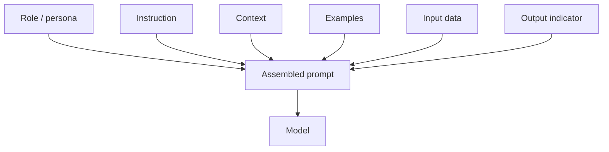
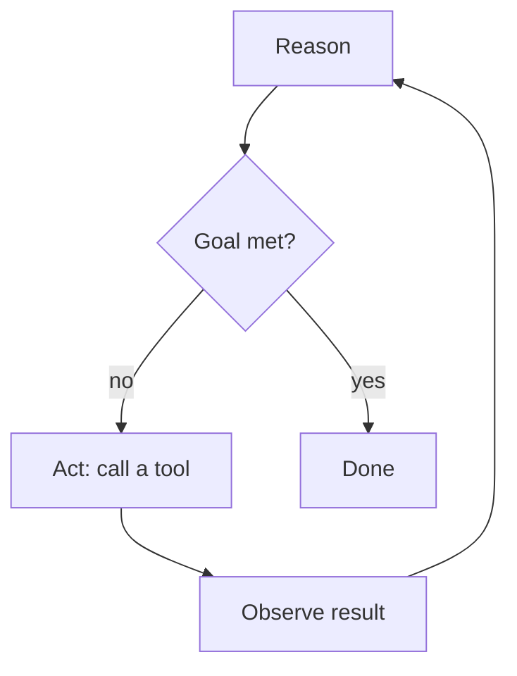

# Part 1 — Concepts, Fast

*Part 1 of 4 · ~15 minutes · [Intro](00-introduction.md) · [Part 2 →](part-2-tools.md)*

This part is the vocabulary. Everything later in the guide is an application of one of these ideas, so it pays to have crisp definitions and to know which paper each idea traces back to. We organize the field into **three pillars**:

1. **Prompt Engineering** — how you ask.
2. **Context Engineering** — what the model can see when it answers.
3. **Harness & the Agentic Era** — the runtime that turns a one-shot text predictor into a tool-using agent.

The pillars are connected. A "few-shot example" (prompt engineering) is often *retrieved* at runtime (context engineering). "Chain-of-thought" (prompt engineering) becomes a built-in behavior of reasoning models (harness era). We mark these links with **→** so you can follow them; the [interactive map](../artifact/index.html) animates the same connections.

> One honest framing note before we start: this guide is about *using* these techniques, not deriving them. Where a term has a canonical paper, it's linked so you can go as deep as you want. The transformer architecture itself comes from *Attention Is All You Need* ([Vaswani et al., 2017](https://arxiv.org/abs/1706.03762)) [R-001]; instruction-following behavior from *InstructGPT* ([Ouyang et al., 2022](https://arxiv.org/abs/2203.02155)) [R-002]. We build on top of that.

---

## Pillar A — Prompt Engineering

**Definition.** Prompt engineering is the practice of structuring the text you send a model so it reliably produces what you need. With smaller local models this matters *more*, not less: they follow explicit structure far better than they infer intent.

### A1 · Anatomy of a prompt
A well-formed prompt has up to six parts: an **instruction** (the task), a **role / persona** (who the model should act as), **context** (background it needs), **input data** (the thing to operate on), an **output indicator** (the shape of the answer), and **examples** (demonstrations). Naming these parts turns "writing a prompt" into assembling a known structure.

<!-- medium: assets/prompt-anatomy.png -->

- **Message roles.** Modern chat APIs separate messages into `system` (durable rules), `developer` (application policy), `user`, `assistant`, and `tool` roles. Keeping rules in `system` instead of mixing them into the user turn measurably improves obedience.
- **Delimiters and structure.** XML tags, Markdown sections, and fenced code blocks give the model unambiguous boundaries. On a local 8B–24B model this is often the single biggest quality lever.

### A2 · Zero-shot prompting
Asking the model to do a task with no examples, relying purely on what it learned in pretraining. The baseline mode; works well for common tasks, degrades on niche formats.

### A3 · Few-shot (and one-shot) prompting
Showing the model one or a handful of input→output examples so it infers the pattern. Introduced at scale in *Language Models are Few-Shot Learners* ([Brown et al., 2020 — the GPT-3 paper](https://arxiv.org/abs/2005.14165)) [R-003]. Few-shot is the cheapest way to lock in a tone or an output format.
**→** The examples don't have to be hardcoded. In Part 1 Pillar B (RAG) we *retrieve* the most relevant examples per request — "dynamic few-shot." (See **B4**.)

### A4 · Chain-of-thought (CoT)
Prompting the model to produce intermediate reasoning steps ("think step by step") before the final answer, which raises accuracy on multi-step problems. From *Chain-of-Thought Prompting Elicits Reasoning in Large Language Models* ([Wei et al., 2022](https://arxiv.org/abs/2201.11903)) [R-004].
**→** In the harness era this becomes a *model capability* rather than a prompt trick — see **C6 reasoning models**.

### A5 · Decomposition (least-to-most, tree-of-thought)
Breaking a hard task into ordered sub-tasks. *Least-to-Most Prompting* ([Zhou et al., 2022](https://arxiv.org/abs/2205.10625)) [R-005] solves easy sub-problems first; *Tree of Thoughts* ([Yao et al., 2023](https://arxiv.org/abs/2305.10601)) [R-006] explores multiple reasoning branches.
**→** Decomposition is what an agent does across many turns — see **C4 multi-turn**.

### A6 · Output contracts / structured output
Instructing the model to return a specific machine-readable shape (JSON matching a schema). This is what makes an LLM safe to wire into other software. LM Studio enforces this server-side: pass a `response_format` of type `json_schema` and the server constrains decoding to that schema ([LM Studio structured output](https://lmstudio.ai/docs/developer/openai-compat/structured-output)) [R-057]. One gotcha with reasoning models — they may emit the reasoning trace on a separate `reasoning_content` channel, so parse the schema from the answer content, not the whole response.
**→** Implemented concretely in Part 4: the flagship `sentiment-app` passes a Pydantic model as the JSON schema and validates the reply back into that model.

### A7 · Constraints, guardrails, and negative prompting
Telling the model what *not* to do, enforcing length/style/safety limits, and specifying refusal behavior. Essential for anything customer-facing.

### A8 · Prompt templates & variables
Parameterized, reusable prompts (`"Summarize {{doc}} in {{n}} bullets"`). The bridge from ad-hoc chatting to engineering.

### A9 · Prompts-as-files (the 2026 shift)
The biggest practical change in the last two years: durable prompts now live in your repository as files that agentic tools read automatically.

- **`AGENTS.md`** — a cross-tool project brief (build commands, test commands, conventions, gotchas). By 2026 it's read by Claude Code, opencode, Cursor, Roo Code, Gemini CLI, Codex CLI and more — the closest thing to a universal standard ([AGENTS.md guide](https://www.augmentcode.com/guides/how-to-build-agents-md)) [R-034]. opencode reads it directly as project "rules" ([opencode rules](https://opencode.ai/docs/rules)) [R-058].
- **`CLAUDE.md`** — Claude-specific, injected into context at the start of every session; project onboarding notes. Claude Code pairs it with *auto memory*, where the agent writes its own notes from your corrections ([Claude Code memory](https://code.claude.com/docs/en/memory)) [R-059].
- **`SKILL.md`** — describes a *capability* (e.g., "write a migration script") with YAML frontmatter; the agent reads only the short `description` and **lazy-loads** the full instructions when a task matches ([Claude Code skills docs](https://code.claude.com/docs/en/skills)) [R-027]. opencode reads the same `SKILL.md` format ([opencode skills](https://opencode.ai/docs/skills)) [R-060].
**→** The lazy-loading of skills is itself context engineering (you keep the window lean — **B1**) and connects to the agent's skill system (**C11**).

### A10 · Meta-prompting & prompt chaining
Using a model to write or refine prompts (meta-prompting), and piping the output of one prompt into the next (chaining) to build pipelines.

---

## Pillar B — Context Engineering

**Definition.** Context engineering is curating everything the model sees at inference time — system prompt, retrieved documents, conversation history, tool results — so the right information is present and the window isn't wasted. In 2026 the field's center of gravity shifted from "write the best prompt" to "manage the best runtime state" ([Awesome Context Engineering](https://github.com/Meirtz/Awesome-Context-Engineering)) [R-011].

### B1 · Context window, tokens, token budget
The model's finite working memory, measured in tokens; input and output share it. Mainstream local models in 2026 commonly reach ~128K tokens, but *usable* context (where quality holds) is smaller. Every design decision is ultimately a budget decision. Locally this is a load-time setting: LM Studio lets you set the context length per model ([LM Studio per-model settings](https://lmstudio.ai/docs/app/advanced/per-model)) [R-061], and its default is low enough that coding assistants overflow it — raise it to at least 8192–16384 (Part 2 covers serving).

### B2 · Context rot / lost-in-the-middle
Stuffing the window degrades quality, and information in the *middle* of a long context is recalled worst. Demonstrated in *Lost in the Middle: How Language Models Use Long Contexts* ([Liu et al., 2023](https://arxiv.org/abs/2307.03172)) [R-009]. The lesson: curate, don't dump.

### B3 · Prompt caching / KV-cache
Reusing the model's computed key–value tensors for a stable prompt **prefix** so repeated requests skip recomputation — up to ~90% cost/latency savings on the static portion ([Anthropic prompt caching](https://docs.claude.com/en/docs/build-with-claude/prompt-caching)) [R-010]. The rule is **static-first ordering**: put unchanging content (system prompt, tool definitions, reference docs) first and byte-identical, push dynamic content to the end.
**→** This is the runtime payoff of the ordering discipline introduced in **A1**.

### B4 · RAG (Retrieval-Augmented Generation)
Instead of relying on what the model memorized, you retrieve relevant text at query time and inject it. Introduced in *Retrieval-Augmented Generation for Knowledge-Intensive NLP Tasks* ([Lewis et al., 2020](https://arxiv.org/abs/2005.11401)) [R-007]. The pipeline:

1. **Chunk** documents (size / overlap / semantic boundaries).
2. **Embed** each chunk into a vector (locally via the server's `/v1/embeddings`).
3. **Store** vectors in a database (Chroma, FAISS — local, zero infra).
4. **Retrieve** the top-k most similar chunks for a query (dense retrieval, *DPR* — [Karpukhin et al., 2020](https://arxiv.org/abs/2004.04906)) [R-008].
5. **Inject** them into the prompt and optionally **rerank** first.

**→** RAG is also how **A3 few-shot** scales: retrieve the best examples per request rather than hardcoding them.

### B5 · Memory (short-term and long-term)
**Short-term** memory is the conversation buffer in the current window. **Long-term** memory persists across sessions — saved to files or a vector store and retrieved when relevant. The canonical reference is *MemGPT* ([Packer et al., 2023](https://arxiv.org/abs/2310.08560)) [R-044#k1], which treats the window like RAM and external storage like disk, paging information in and out so an agent works around its finite context. Agents like Hermes build "a deepening model of who you are across sessions" from persistent memory (Part 2).
**→** Long-term memory and **C10 subagents** combine: each subagent can carry its own scoped memory.

### B6 · Context compaction / summarization
When history outgrows the window, replace older turns with a running summary. Keeps long sessions coherent without blowing the budget.

### B7 · Tool-result management / pruning
Agent tool calls return verbose output (file dumps, API responses). Trimming or summarizing those results before they re-enter the context is one of the highest-leverage moves in agent design.

### B8 · Grounding, citations, hallucination reduction
Tying answers to retrieved sources and asking the model to cite them. Grounding is the main defense against confident fabrication in production systems.

### B9 · Long-context vs RAG vs caching — the decision
Three ways to get information to the model: stuff a long context, retrieve with RAG, or cache a stable prefix. A cheat-sheet: **RAG** when the corpus is large and changing; **long context** when the documents are few and must be reasoned over holistically; **caching** when the same large prefix is reused across many calls. Often you combine all three.

---

## Pillar C — Harness & the Agentic Era

**Definition.** A **harness** is the runtime layer between the model and the world. LLMs are stateless text predictors; the harness gives them hands (tools), a loop, memory, and guardrails — turning a model into an *agent* ([What is an agent harness](https://www.firecrawl.dev/blog/what-is-an-agent-harness)) [R-017].

### C1 · The harness
The framework that manages the model connection, registers the tools the agent may call, dispatches those calls, and controls what stays in the context window. opencode, Claude Code, Crush and Roo Code are all harnesses. Concretely, Claude Code ships built-in tools (read/edit files, run shell, search) and extends them with custom commands and MCP servers; opencode exposes the same built-in tool set plus user-defined custom tools ([opencode tools](https://opencode.ai/docs/custom-tools)) [R-062].

### C2 · Agent
An LLM placed inside a loop, given tools and a goal, allowed to act until the goal is met.

### C3 · The agent loop / ReAct
The core pattern: **reason → act (call a tool) → observe the result → reason again**, repeating until done. From *ReAct: Synergizing Reasoning and Acting in Language Models* ([Yao et al., 2022](https://arxiv.org/abs/2210.03629)) [R-012]. It's the default agent loop — the shape behind opencode, Claude Code, and LangChain's agent executors.

<!-- medium: assets/react-loop.png -->

### C4 · Multi-turn / multi-step problem solving
Sustaining one goal across many loop iterations — reading a file, editing it, running tests, fixing failures. The practical expression of **A5 decomposition**.

### C5 · Tool calling / function calling
The mechanism that lets a model invoke code: it emits a structured call, the harness runs it, the result returns as a `tool` message. The hinge of the whole agentic era. Foreshadowed by *Toolformer: Language Models Can Teach Themselves to Use Tools* ([Schick et al., 2023](https://arxiv.org/abs/2302.04761)) [R-013].

### C6 · Reasoning models / extended thinking
Models trained to emit an internal reasoning trace before the final answer, internalizing **A4 chain-of-thought**.
- **The "thinking…/synthesizing…" words you see in CLI agents.** When Claude Code or a similar tool prints status words like *"Synthesizing…"*, *"Reflecting…"*, *"Exploring…"*, those are **surface reflections of the model's reasoning state** during extended thinking — a UX rendering of the chain-of-thought process, not the final output. Worth naming explicitly because your audience *will* ask what those words mean.

### C7 · Reflection / self-critique / self-correction
The agent reviews and improves its own output before continuing. *Reflexion* ([Shinn et al., 2023](https://arxiv.org/abs/2303.11366)) [R-014] adds verbal self-feedback as a learning signal; *Self-Refine* ([Madaan et al., 2023](https://arxiv.org/abs/2303.17651)) [R-015] iterates with self-generated critique. This is why agents can catch their own mistakes.

### C8 · Steering an agent
The human-in-the-loop controls: **plan mode vs build mode**, interrupting mid-task, redirecting, and approving steps before they execute. Steering is what keeps a long agentic run on track.

### C9 · Planning / task decomposition
Explicitly generating a plan before acting. Most capable harnesses expose a "plan first, then execute" flow.

### C10 · Subagents / multi-agent orchestration
Delegating sub-tasks to isolated agents, each with its own context, terminal, and tools. The canonical orchestration reference is *AutoGen* ([Wu et al., 2023](https://arxiv.org/abs/2308.08155)) [R-045], where specialized conversable agents exchange messages to solve a task instead of one monolithic prompt. Hermes runs **asynchronous** subagents so delegated work doesn't block the main chat ([MarkTechPost](https://www.marktechpost.com/2026/06/16/hermes-agent-adds-asynchronous-subagents-so-delegated-work-no-longer-blocks-the-parent-chat/)) [R-031]; the ECC project ships 60+ specialized subagents. Both harnesses expose this directly — Claude Code defines a subagent as a Markdown file with its own tools and scoped context ([Claude Code subagents](https://code.claude.com/docs/en/sub-agents)) [R-065]; opencode calls the same primitive an "agent" ([opencode agents](https://opencode.ai/docs/agents)) [R-066].

### C11 · Skills, instincts, continuous learning
Reusable capabilities the agent loads on demand (**A9 SKILL.md**) or, at the frontier, *learns from experience* and persists. The design inspiration is *Voyager* ([Wang et al., 2023](https://arxiv.org/abs/2305.16291)) [R-046#k1], whose persistent skill library of executable code stores, retrieves, and composes learned behaviors so capability compounds over time. Present "self-improving" claims (Hermes, ECC) as design goals rather than benchmarked guarantees.

### C12 · MCP (Model Context Protocol)
An open standard for giving agents external tools, data sources, and resources through a uniform interface ([modelcontextprotocol.io](https://modelcontextprotocol.io)) [R-016]. The "USB-C port" for agent tooling. Both harnesses consume it the same way: you register a server (local stdio or remote) in config and its tools appear to the agent — Claude Code via `claude mcp add` ([Claude Code MCP](https://code.claude.com/docs/en/mcp)) [R-063], opencode via an `mcp` block in `opencode.json` ([opencode MCP servers](https://opencode.ai/docs/mcp-servers)) [R-064].

### C13 · Permissions / approvals / sandboxing
Controls over what an agent may execute — read-only vs write, command allow-lists, sandboxes. The safety layer; never give an agent unrestricted shell on production.

### C14 · Observability / traces
Recording what the agent did and why — the tool calls, the reasoning, the costs — so you can debug and trust it.

### C15 · Execution patterns
Beyond the simple loop, harnesses implement **event-driven**, **state-machine**, **graph/flow**, and **hybrid** control models. Naming them helps you recognize how a given tool is built ([Awesome Harness Engineering](https://github.com/ai-boost/awesome-harness-engineering)) [R-018].

---

## The cross-reference map

The pillars aren't a list, they're a graph. The connections worth highlighting in a talk:

- **A3 ↔ B4** — few-shot examples are retrieved by RAG ("dynamic few-shot").
- **A4 ↔ C6** — chain-of-thought becomes a built-in reasoning-model behavior.
- **A9 ↔ C11** — `SKILL.md` files are how skills are authored and lazy-loaded.
- **A1 ↔ B3** — static-first prompt ordering is what makes prompt caching work.
- **B5 ↔ C10** — persistent memory plus isolated subagents enable long-horizon work.
- **A6 ↔ Part 4** — output contracts are the foundation of every production app.

The [interactive map](../artifact/index.html) is built around exactly these nodes and edges — hover a node to focus it, click to read the summary and jump here.

---

*Next: [Part 2 — The Tools](part-2-tools.md) · [References](references.md) · [Interactive map](../artifact/index.html)*
