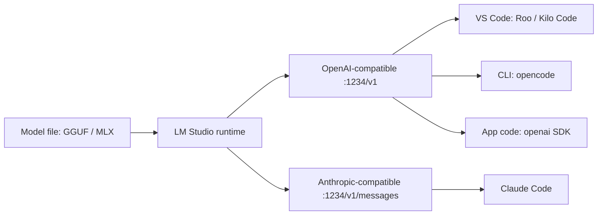

# Part 3 — Serve a Model, Bind Your Tools, Pick the Right One

*Part 3 of 4 · [← Part 2](part-2-tools.md) · [Part 4 →](part-4-projects.md)*

This is the hands-on core. Stand up a local server with LM Studio, bind your editor and CLI agents to it, walk the Claude Code path *and* the fully open-source path, then pick a model your hardware can actually run.


<!-- medium: assets/serving-stack.png -->

---

## 3.1 · Serve a model (the keystone)

In LM Studio: open the **Developer** tab, load a model, toggle **Start Server** ([LM Studio server docs](https://lmstudio.ai/docs/developer/core/server)) [R-025]. One server exposes two compatibility surfaces on the same port:

```
Base URL (OpenAI):  http://localhost:1234/v1
  GET  /models                  GET  /v1/models — list loaded/available model ids
  POST /chat/completions         the workhorse for chat + tool-calling
  POST /completions              legacy text completion
  POST /embeddings               vectors for RAG
Anthropic surface:  http://localhost:1234/v1/messages   (POST — for Claude Code)
```

The OpenAI endpoint list is fixed — `/v1/models`, `/v1/chat/completions`, `/v1/completions`, `/v1/embeddings`, plus `/v1/responses` for Codex ([OpenAI-compat docs](https://lmstudio.ai/docs/developer/openai-compat)) [R-025]. The Anthropic surface is a single endpoint, `POST /v1/messages`, which is what makes Claude Code work against a local model ([Anthropic-compat docs](https://lmstudio.ai/docs/developer/anthropic-compat)) [R-069].

**Serve headless from the terminal** with the `lms` CLI — no GUI needed:

```bash
npx lmstudio install-cli      # one-time: install `lms`
lms server start              # start on the last-used port
lms server start --port 1234  # or pin the port
lms server status             # confirm it's up
```

`lms server start` also takes `--cors` (for some VS Code extensions / web apps) and `--bind 0.0.0.0` to expose on the LAN — both carry a security warning, so enable authentication if you use them ([server-start docs](https://lmstudio.ai/docs/cli/serve/server-start)) [R-072].

**Prove it speaks OpenAI.** List the loaded model id, then send a chat request — changing only the base URL of the standard SDK:

```bash
curl http://localhost:1234/v1/models        # get the exact model id LM Studio is serving

curl http://localhost:1234/v1/chat/completions \
  -H "Content-Type: application/json" \
  -d '{
    "model": "qwen/qwen3.6-35b-a3b",
    "messages": [{"role": "user", "content": "Say hi in one word."}],
    "temperature": 0.7
  }'
```

```python
from openai import OpenAI

client = OpenAI(base_url="http://localhost:1234/v1", api_key="lmstudio")  # key ignored locally
resp = client.chat.completions.create(
    model="qwen/qwen3.6-35b-a3b",        # must match an id from GET /v1/models
    messages=[{"role": "user", "content": "Say hi in one word."}],
)
print(resp.choices[0].message.content)
```

That is the entire trick. **The same code runs against OpenAI, Azure OpenAI, or OpenRouter** by changing `base_url` and `api_key` ([OpenAI-compat docs](https://lmstudio.ai/docs/developer/openai-compat)) [R-025]. The api key is a dummy locally — any string works. Hold onto this; it's the backbone of every Part 4 project.

---

## 3.2 · Bind your tools to the local server

This is the heart of Part 3. Every tool below points at the *same* `http://localhost:1234/v1` and uses a dummy key. One rule across all four: **the Model ID must match an id from `GET /v1/models` exactly.** Whatever you typed when you downloaded — e.g. `qwen/qwen3.6-35b-a3b` — is the string the tool needs.

> **Context window.** Coding agents send large workspace context. In LM Studio's model load/server settings, raise the **Context Length** to at least `8192`–`16384` (Claude Code wants ≥25k) or the server will reject requests with a token-overflow error.

### opencode → LM Studio (the fully-open path)

Edit `~/.config/opencode/opencode.json` (Windows: `$HOME\.config\opencode\opencode.json`) and add a custom provider that wraps the OpenAI-compatible adapter ([opencode docs](https://opencode.ai/docs/)) [R-026]:

```json
{
  "provider": {
    "lmstudio": {
      "npm": "@ai-sdk/openai-compatible",
      "name": "LM Studio (local)",
      "options": {
        "baseURL": "http://localhost:1234/v1"
      },
      "models": {
        "qwen/qwen3.6-35b-a3b": {
          "name": "qwen/qwen3.6-35b-a3b"
        }
      }
    }
  }
}
```

Launch from a workspace and select the provider:

```bash
cd ~/your-project
opencode .
# inside the TUI: press Ctrl+O (or type /models), pick "LM Studio (local)",
# enter placeholder text (e.g. `local`) at any API-key prompt
```

> If you ever installed opencode with `sudo`, its config dir can end up root-owned and you'll hit `PermissionDenied: FileSystem.open`. Fix once: `sudo chown -R $(whoami) ~/.local/share/opencode ~/.config/opencode`. Never run `sudo opencode .`.

### Roo Code → LM Studio (VS Code)

In the Roo Code sidebar → **Gear (Settings)**, set **API Provider = OpenAI Compatible** ([Roo Code + LM Studio](https://docs.roocode.com/providers/lmstudio)) [R-029]:

- **Base URL**: `http://localhost:1234/v1`
- **API Key**: any dummy value (`local`)
- **Model ID**: `qwen/qwen3.6-35b-a3b`

Drive it in *architect* mode (plan) then *code* mode (build); add a repo `AGENTS.md` so it follows your conventions.

### Kilo Code → LM Studio (VS Code, by file)

If you'd rather configure by file than by UI, create `~/.config/kilo/kilo.jsonc`:

```jsonc
{
  "$schema": "https://app.kilo.ai/config.json",
  "provider": {
    "lmstudio": {
      "name": "LM Studio (local)",
      "options": {
        "baseURL": "http://localhost:1234/v1"
      },
      "models": {
        "qwen/qwen3.6-35b-a3b": {
          "name": "Qwen 35B Local"
        }
      }
    }
  }
}
```

### Claude Code → LM Studio (the Anthropic surface)

Claude Code talks Anthropic, not OpenAI — so point it at the `/v1/messages` surface via three env vars, then pass the local model id ([Claude Code + local LLM](https://renezander.com/guides/claude-code-local-llm-anthropic-base-url/) [R-028]; [LM Studio Claude Code integration](https://lmstudio.ai/docs/integrations/claude-code) [R-071]):

```bash
export ANTHROPIC_BASE_URL=http://localhost:1234   # note: no /v1 — base host only
export ANTHROPIC_AUTH_TOKEN=lmstudio              # dummy unless auth is enabled
export CLAUDE_CODE_ATTRIBUTION_HEADER=0
claude --model qwen/qwen3.6-35b-a3b
```

To wire the same thing into Claude Code's VS Code extension, set it in `settings.json`:

```jsonc
"claudeCode.environmentVariables": [
  { "name": "ANTHROPIC_BASE_URL", "value": "http://localhost:1234" },
  { "name": "ANTHROPIC_AUTH_TOKEN", "value": "lmstudio" }
]
```

This is where Part 1 stops being theory: a repo `AGENTS.md`, one custom `SKILL.md`, and a rule make the agent behave consistently — across cloud *or* local backend, since only the base URL changed.

---

## 3.3 · The three tool paths

You don't pick one forever. Most developers iterate locally for cheap/private work and switch the *same* toolchain to the cloud for the hard 10%.

| Path | CLI / harness | Engine | When |
|---|---|---|---|
| Claude Code (subscription) | Claude Code | Anthropic cloud, frontier models | hard, high-stakes work |
| Claude Code + LM Studio | Claude Code | local open-weight via `/v1/messages` | keep the harness, run it offline/private |
| **opencode + LM Studio** | opencode (open) | local open-weight via `/v1` | **fully open / local** — no subscription, no data leaving the machine |

The bottom row is the one to internalize: an open harness + an open engine + an open-weight model is a complete coding agent with nothing proprietary in the loop.

---

## 3.4 · Choosing a model — purpose × hardware × license × latency

Decide along four axes:

1. **Purpose** — chat / general coding / agentic multi-file work / embeddings.
2. **Hardware ceiling** — how much memory you can dedicate (see §3.5).
3. **License** — open vs open-weight vs restricted (matters for commercial use).
4. **Latency tolerance** — interactive editing wants speed; a nightly batch can be slow.

Names move monthly, so this article does not rank models in prose. The authoritative picks-by-hardware and picks-by-task live in **[`model-table.md`](../model-table.md)** (refreshed against current model cards and the [LM Arena code leaderboard](https://lmarena.ai/leaderboard/code) [R-036], with the open-source filter). Read it there; treat any name you remember from last quarter as stale.

---

## 3.5 · How big is too big? VRAM and quantization

The question "can my machine run this?" reduces to one formula:

```
Memory ≈ (parameters × bytes-per-parameter) + KV-cache(context length)
```

**Bytes per parameter, by precision:**

| Precision | Bytes/param | A 7B model needs | A 24B model needs |
|---|---|---|---|
| FP16 (full) | 2.0 | ~14 GB | ~48 GB |
| Q8 (8-bit) | ~1.0 | ~7 GB | ~24 GB |
| Q5_K_M | ~0.68 | ~5 GB | ~16 GB |
| Q4_K_M | ~0.57 | ~4 GB | ~14 GB |

Rule of thumb: **~2 GB per billion parameters at FP16**, dropping to **~0.5 GB/B at 4-bit**. Modern 4-bit methods — GGUF, *GPTQ* ([Frantar et al., 2022](https://arxiv.org/abs/2210.17323)) [R-019], *AWQ* ([Lin et al., 2023](https://arxiv.org/abs/2306.00978)) [R-020] — keep quality within ~1–3% of full precision ([quantization guide](https://llmhardware.io/guides/llm-quantization-guide)) [R-024].

**MoE changes the math.** For a Mixture-of-Experts model, the *whole* weight set must be resident in RAM/VRAM (footprint tracks **total** params), but only a few experts fire per token, so compute tracks the much smaller **active** param count. A 35B-A3B model occupies ~18–20 GB at Q4 yet infers at roughly the speed of a 3B dense model.

**The interactive visual** is the artifact's **Hardware tab** — model sizes plotted against the hardware needed to serve them, with a **Bars / GPU-units** sub-view (flip to GPU units to see the raw card count). It covers the current open-weight landscape (DeepSeek-V4, Kimi K2.6, GLM-5.1, Qwen3.6 …) plus dashed *capability estimates* for closed models, with selectable precision and GPU type and the 8/16/48/80 GB ceilings drawn in. See **[the Hardware tab](../artifact/index.html)** rather than memorizing numbers here.

---

## 3.6 · Consume it from code

Every Part 4 project calls the local server through the standard `openai` SDK — base URL `http://localhost:1234/v1`, dummy key — and asks for **JSON-schema-constrained output** so the model returns data the program can trust ([structured-output docs](https://lmstudio.ai/docs/developer/openai-compat/structured-output)) [R-057]:

```python
from openai import OpenAI

client = OpenAI(base_url="http://localhost:1234/v1", api_key="lmstudio")
resp = client.chat.completions.create(
    model="qwen/qwen3.6-35b-a3b",
    messages=[{"role": "user", "content": "Classify: 'Bu ürünü çok beğendim!'"}],
    response_format={
        "type": "json_schema",
        "json_schema": {
            "name": "sentiment",
            "schema": {
                "type": "object",
                "properties": {"label": {"type": "string"}, "score": {"type": "number"}},
                "required": ["label", "score"],
            },
        },
    },
)
# content arrives as a JSON string in choices[0].message.content — parse, then validate with Pydantic
```

LM Studio enforces the schema with `llama.cpp` grammar sampling (GGUF) or Outlines (MLX); note that models below ~7B may not support it. Part 4's `sentiment-app` does exactly this — `response_format=json_schema`, parse, validate with a Pydantic model, retry once on schema failure, quarantine the row otherwise. → [Part 4 — Hands-on Projects](part-4-projects.md).

---

## 3.7 · When you don't need an LLM at all

Not every task needs a 24B generative model. For **single-language, single-task** jobs — sentiment, topic tagging, language ID — a small encoder is faster, cheaper, and runs on CPU.

```python
from transformers import pipeline

clf = pipeline("sentiment-analysis",
               model="distilbert-base-multilingual-cased-sentiments-student")
print(clf("Bu ürünü çok beğendim, kalitesi harika!"))   # works across languages
```

**DistilBERT** ([Sanh et al., 2019](https://arxiv.org/abs/1910.01108)) [R-023] is ~40% smaller and ~60% faster than BERT while keeping ~97% of its performance. Picks worth knowing: `distilbert-base-multilingual-cased`, `tabularisai/multilingual-sentiment-analysis`, `nlptown/bert-base-multilingual-uncased-sentiment`, and **Transformers.js** for the browser/Node.

To classify 100k survey responses, a 100 MB classifier beats a 24B LLM on cost and latency. *Pick the smallest tool that does the job.* (Proven with a head-to-head in Part 4, Project 1.)

> **Named only, by request:** **Ollama** (CLI serving), **[vLLM](https://arxiv.org/abs/2309.06180)** [R-050] (high-throughput production serving), **Unsloth** (efficient fine-tuning). See the Part 2 decision matrix for where each fits.

---

## 3.8 · Section summary

Serve once with LM Studio — one server, an OpenAI surface at `:1234/v1` and an Anthropic surface at `:1234/v1/messages`. Bind every tool to it by base URL + dummy key: opencode and Kilo by config file, Roo Code by UI, Claude Code by `ANTHROPIC_BASE_URL`. The fully-open path is opencode + LM Studio + an open-weight model. Choose models by purpose × hardware × license × latency — sizing in `model-table.md` and the artifact Hardware tab — and remember the escape hatch: sometimes a tiny classifier is the right answer.

Now we build real apps on top of all this.

---

*Next: [Part 4 — Hands-on Projects](part-4-projects.md) · [References](references.md) · [Interactive map](../artifact/index.html)*
