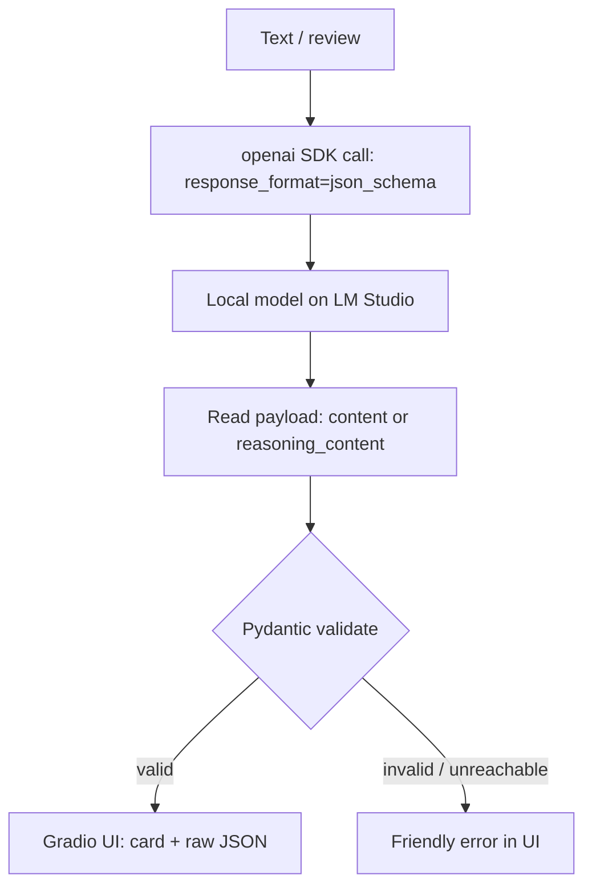

# Part 4 — Hands-on Projects

*Part 4 of 4 · [← Part 3](part-3-serve-and-code.md) · [References](references.md)*

Now we build. The flagship is **`sentiment-app/`** — the smallest end-to-end shape that's still real: text goes to a local model through the OpenAI-compatible endpoint, comes back as structured JSON the schema guarantees, gets validated by Pydantic, and renders in a Gradio UI. It runs fully local on LM Studio and deploys to Hugging Face Spaces by pointing three environment variables at a reachable endpoint — no code change. The build specs (PRD, proposals, per-package requirements) live in [`projects/`](../projects/PRD.md).

## The flagship: `sentiment-app/`

One screen, one job: paste text, get a sentiment classification back as a typed object — `sentiment`, a signed `score` in `[-1, 1]`, a `confidence`, and a one-line `rationale`. The model runs in LM Studio (`qwen/qwen3.6-35b-a3b`; standings in [`model-table.md`](../model-table.md)), the app talks to it through the `openai` SDK, and Gradio draws the result. That's the whole loop, and it's the loop every larger app is made of.

The schema is the contract. It's declared twice — once as the JSON Schema sent to the model in `response_format`, once as the Pydantic model the response is validated against:

```python
class SentimentResult(BaseModel):
    sentiment: Literal["positive", "negative", "neutral"]
    score: float = Field(ge=-1.0, le=1.0)
    confidence: float = Field(ge=0.0, le=1.0)
    rationale: str

RESPONSE_FORMAT = {
    "type": "json_schema",
    "json_schema": {"name": "sentiment_result", "strict": True, "schema": {...}},
}
```

This is **A6 output contracts** made concrete (see [Part 1 → A6](part-1-concepts.md)). `response_format={"type": "json_schema", ...}` makes the model emit JSON that matches the shape; `SentimentResult.model_validate_json(...)` is the boundary check that decides whether the output is safe to use. Structure from the model is a strong prior, not a guarantee — the Pydantic validation is what actually protects the code downstream.

## What it teaches

**1 · The structured-output contract is what makes an LLM safe to wire into software.** Free-text replies force you to parse prose; a JSON-schema response plus Pydantic validation gives you a typed object or a caught error, nothing in between. The same `response_format` + `model_validate_json` pattern scales from this one call to a batch pipeline.

**2 · The reasoning-channel gotcha.** Qwen3 is a reasoning model. Under `response_format=json_schema`, LM Studio emits the structured JSON into the message's `reasoning_content` channel and leaves `content` empty — so a plain read of `message.content` returns nothing. The app reads whichever field carries the payload:

```python
def _payload(message: ChatCompletionMessage) -> str:
    if message.content and message.content.strip():
        return message.content.strip()
    reasoning = (message.model_extra or {}).get("reasoning_content", "") or ""
    text = reasoning.strip()
    if "{" in text and "}" in text:          # reasoning channel may wrap JSON in prose
        text = text[text.find("{") : text.rfind("}") + 1]
    return text
```

This is the kind of detail you only hit by running a real model: the OpenAI SDK shape is standard, but where a given local model puts its output is not. ([model-table.md](../model-table.md) flags this under Structured output.)

**3 · Provider-swappability.** The client is built from three env vars — `LMSTUDIO_BASE_URL`, `LMSTUDIO_MODEL`, `LMSTUDIO_API_KEY`. Point them at LM Studio and the app is local; point `base_url`/`api_key`/model at OpenAI, Azure OpenAI, or OpenRouter and the same code runs against the cloud. The client constructor is the only place that knows the difference.

**4 · Graceful failure.** Two failure modes are handled at the UI boundary, not hidden: a `APIConnectionError` (LM Studio isn't running) becomes "Cannot reach LM Studio at …; is the server running?", and a `ValidationError` / `JSONDecodeError` (the model returned something off-schema) becomes "Model returned malformed output." The app degrades to a clear message instead of a stack trace.

## Data flow


<!-- medium: assets/data-flow.png -->

> Diagram relabeled for the sentiment-app flow (was the generic React→FastAPI→LM Studio architecture) — re-export `assets/data-flow.png`.

## Run it

```bash
cd projects/sentiment-app
pip install -r requirements.txt
python app.py            # opens http://localhost:7860
```

Needs LM Studio serving a chat model on `:1234` (Part 3 covers standing one up; `projects/00-serve-lmstudio/` verifies it). Tests run fully offline — they monkeypatch the OpenAI client, so no live server is required:

```bash
PYTHONPATH=. python -m pytest tests -q
```

## Deploy to Hugging Face Spaces

The `sentiment-app/` repo root is already a valid Gradio Space — the README's YAML header is the Space card. To publish:

1. Create a **Gradio** Space and push `app.py`, `requirements.txt`, and `README.md`.
2. A Space runs in the cloud and **cannot reach your laptop's `localhost`**. Set the endpoint via Space secrets (Settings → Variables and secrets): `LMSTUDIO_BASE_URL` to a reachable OpenAI-compatible endpoint (a cloud provider, or a public tunnel/Colab URL fronting your model), `LMSTUDIO_MODEL` to that endpoint's model id, and `LMSTUDIO_API_KEY` to its real key — stored as a secret, not a plain variable.
3. Leave `GRADIO_SHARE` unset; the platform serves the public URL.

The [interactive concept map](../artifact/index.html) (GitHub Pages) is the hub that links the article, the repo, and the deployed Space together.

## The domain and the data (anonymized, public, reproducible)

The repo's worked example is a generic **fashion-retail customer survey & rewards panel** — surveys, product feedback, vouchers — deliberately free of any company name or PII. The flagship app classifies general text, so it works on any of these out of the box. All datasets are public:

- **[Women's E-Commerce Clothing Reviews](https://www.kaggle.com/datasets/nicapotato/womens-ecommerce-clothing-reviews)** [R-039] — 23,486 reviews, already anonymized to "retailer," with rating, recommend flag, age, and category. The primary set.
- **Turkish** options: [`winvoker/turkish-sentiment-analysis-dataset`](https://huggingface.co/datasets/winvoker/turkish-sentiment-analysis-dataset) [R-040], [`fthbrmnby/turkish_product_reviews`](https://huggingface.co/datasets/fthbrmnby/turkish_product_reviews) [R-041], and the Hepsiburada reviews set.

## Extras — work through these later

Beyond the flagship, [`projects/extras/`](../projects/README.md) holds six numbered demos, each isolating one concept from earlier parts. They're supplementary — pick them up when you want to go deeper, not before. Every one imports the same `common/llm.py` config contract and follows the retry-then-quarantine structured-output rule.

- [`extras/01-prompting`](../projects/extras/01-prompting/) — request anatomy, zero/few-shot, a sample `SKILL.md`. *Concepts: A1, A3.*
- [`extras/02-structured-output`](../projects/extras/02-structured-output/) — Pydantic + `response_format`, retry-then-quarantine. *Concept: A6.*
- [`extras/03-rag-feedback`](../projects/extras/03-rag-feedback/) — product-feedback RAG with local embeddings + [Chroma](https://docs.trychroma.com/docs/overview/introduction) [R-051], grounded cited answers, fully offline. *Concepts: B4, B8.*
- [`extras/04-fullstack-analyzer`](../projects/extras/04-fullstack-analyzer/) — FastAPI + React review analyzer that runs the same batch through a DistilBERT classifier and compares cost, latency, and quality — the "pick the smallest tool" lesson. *Concepts: A1, A6, B7.*
- [`extras/05-conversational-survey`](../projects/extras/05-conversational-survey/) — a multi-turn agent that asks adaptive follow-ups then summarizes into structured insight. *Concepts: C3, C4, B5, B6.*
- [`extras/06-agentic-capstone`](../projects/extras/06-agentic-capstone/) — rebuild the full-stack analyzer *using* an agent (opencode or Claude Code on a local model) driven by `AGENTS.md` + a custom `SKILL.md`. The meta-lesson: the harness builds the app. *Concepts: C1–C9, A9.*

## Summary

The flagship sentiment-app is the whole course in one screen: local model → JSON-schema request → Pydantic validation → UI, swappable to any cloud provider through three env vars and deployable to a Space without touching the code. The two details that don't show up in tutorials but bite in practice — the reasoning-channel payload and validation-as-boundary — are exactly the ones the app exists to teach. The extras are there when you want to take any one piece further.

---

*Back to: [Intro](00-introduction.md) · [References](references.md) · [Interactive map](../artifact/index.html)*
