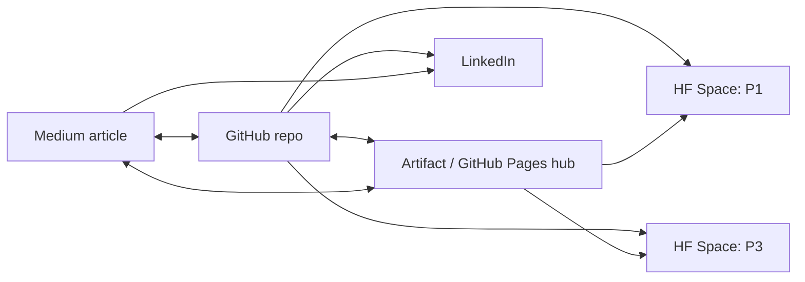

# Link registry — single source of truth for every public URL

> Fill each placeholder once here, then find-and-replace the token across the repo (article footers,
> artifact hub panel, README badges). The artifact is the **hub**: it surfaces all of these so any
> entry point leads to all the others. Keep tokens in `{{...}}` form until the real URL exists.

| token | what | value |
|-------|------|-------|
| `https://github.com/ertugruldmr/local-llm-for-developers-guide` | Public repo (PRACTICAL-LLM-GUIDE-FOR-DEVELOPERS) | `https://github.com/ertugruldmr/local-llm-for-developers-guide` |
| `https://ertugruldmr.github.io/local-llm-for-developers-guide/` | Artifact on GitHub Pages | `https://ertugruldmr.github.io/local-llm-for-developers-guide/` |
| `https://medium.com/@ertugrulbusiness/running-and-building-with-local-llms-a-practical-guide-for-developers-26210883fe80` | Published Medium article (base) | `https://medium.com/@ertugrulbusiness/running-and-building-with-local-llms-a-practical-guide-for-developers-26210883fe80` |
| `https://huggingface.co/spaces/ErtugrulDemir/sentiment-analyzer` | HF Space — **sentiment-app** (the published flagship demo) | `https://huggingface.co/spaces/ErtugrulDemir/sentiment-analyzer` |
| `https://huggingface.co/spaces/ErtugrulDemir/sentiment-analyzer` | HF Space — P1 Review Analyzer demo (extras, later) | `https://huggingface.co/spaces/ErtugrulDemir/sentiment-analyzer` |
| `{{HF_SPACE_P3}}` | HF Space — P3 Feedback RAG demo (extras, later) | `{{HF_SPACE_P3}}` |
| `{{LINKEDIN_URL}}` | Author LinkedIn (for the portfolio binding) | `{{LINKEDIN_URL}}` |

## The constellation (each surface links to the rest)

## Where each token is consumed
- `article/*.md` footers + `article/references.md` "Author artifacts" (`https://medium.com/@ertugrulbusiness/running-and-building-with-local-llms-a-practical-guide-for-developers-26210883fe80`, `https://github.com/ertugruldmr/local-llm-for-developers-guide`, `https://ertugruldmr.github.io/local-llm-for-developers-guide/`).
- `artifact/index.html` — `ARTICLE_BASE`/`https://medium.com/@ertugrulbusiness/running-and-building-with-local-llms-a-practical-guide-for-developers-26210883fe80` today; hub links panel (artifact-v3) reads all tokens.
- `README.md` — badges + "Live demo / Article / Map" links.
- `projects/*/README.md` — link back to its HF Space + the article section.

## Publish procedure (once URLs exist)
1. Replace tokens in this file with real values.
2. `grep -rl '{{' --include='*.md' --include='*.html' .` to find every remaining token; replace.
3. `scripts/publish.sh --dry-run` → confirm → `scripts/publish.sh`.
